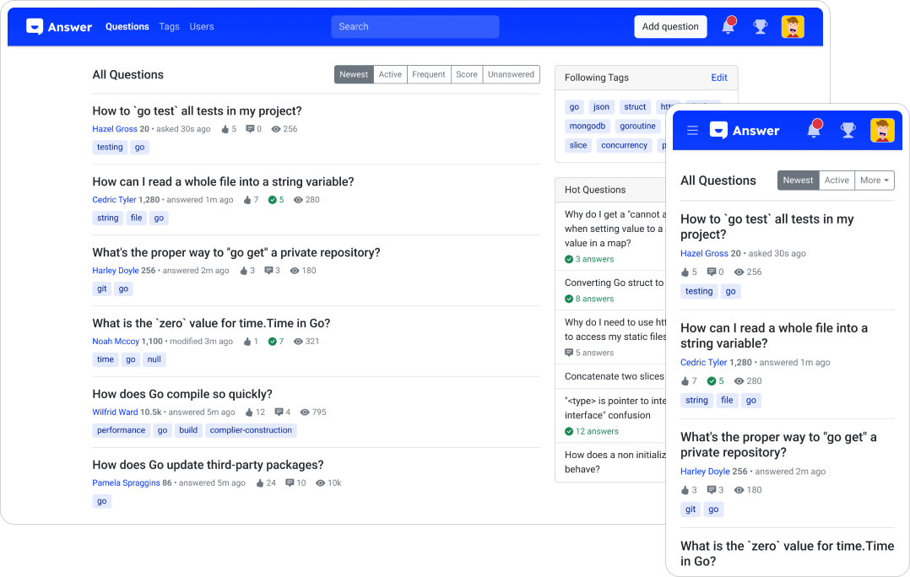

# Answer CI/CD pipeline

Deploy Answer server with CI/CD on Elestio

 
 

# Once deployed ...

Before connecting to the application, check in your mailbox: [ADMIN_EMAIL] a confirmation message from Answer.
Once your email address is confirmed, log-in with the following credentials:

    Login: [ADMIN_EMAIL]
    password: [ADMIN_PASSWORD]
